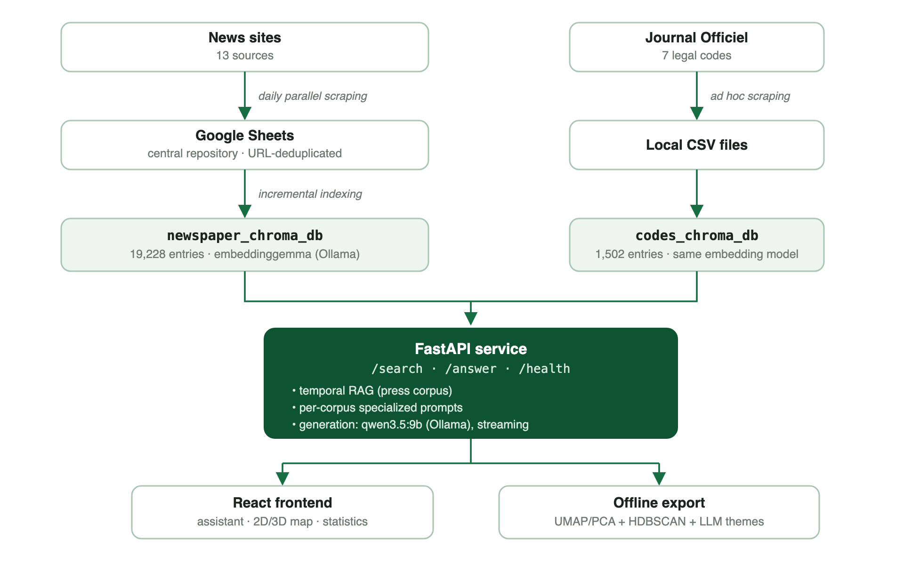

# Le Kiosque

## A sovereign document-intelligence platform for the Gabonese press

**White paper · Version 3.0 · July 2026**
Author: Vhiny Mombo

---

## Executive summary

Le Kiosque is a platform that aggregates Gabon's online press daily and makes it queryable in natural language. A reader can ask "What's in the news today?" or "What is happening with SEEG?" and receive, within seconds, a written synthesis that is dated and systematically sourced, generated from the articles themselves and never from the model's general knowledge. A second corpus, the Gabonese legal codes from the Journal Officiel, is queryable through the same interface with systematic citation of article numbers.

Three choices structure the project:

1. **Retrieval-augmented generation (RAG)**: every answer is built exclusively from real documents retrieved from the corpus. This constraint eliminates the main failure mode of generic AI assistants, invented facts, and guarantees that every claim is traceable to its source.
2. **Time awareness**: news is perishable material. Le Kiosque implements full *temporal RAG*: date-window extraction from the question, range filtering at the index level, and ranking by a composite relevance × freshness score.
3. **Technological sovereignty**: the entire chain (collection, indexing, retrieval, generation) runs locally, on a single machine, with open-source models. No data transits through a third-party AI service, and the marginal cost of a question is zero.

The press corpus covers thirteen Gabonese online outlets, totaling 18,517 articles as of July 20, 2026, collected continuously since December 2025 (historical backfill reaches back to September 2025 for some sources). The legal corpus counts 1,502 law articles from five codes currently in force.

---

## 1. Context and motivations: a rich press, fragmented access

Gabon's online press is lively and diverse, but working with it is laborious. Information is scattered across independent sites, with no cross-outlet search engine, no shared structured archive, and no simple way to reconstruct the timeline of an ongoing story (a water crisis, a finance bill, a professional election) across multiple newsrooms.

Mainstream AI assistants only partially fill this gap. Equipped with web-search tools, they can now consult online sources and cite links. But their coverage of the Gabonese press remains hostage to how well major search engines index low-international-traffic sites; they sample a handful of pages at question time, with no exhaustive corpus and no archive (an unpublished article or a temporarily offline site falls out of their reach); they offer neither corpus-wide analysis (volumes, themes, timelines) nor control over the source perimeter; and every question transits through foreign infrastructure, at a per-use cost. Conventional search engines, for their part, return links rather than answers.

Le Kiosque occupies the space between the two: an exhaustive, controlled, archived national corpus enriched daily, queryable in natural language, with every answer anchored in identified documents.

### 1.1 Project motivations

Five motivations, explicit from the outset, structure the project:

1. **Making the diversity of the Gabonese press actually usable.** The online media landscape is remarkably abundant: in early 2024 the Haute Autorité de la Communication counted [169 online media outlets, 29 of them in regular administrative standing](https://gabonmediatime.com/gabon-liste-des-29-medias-en-ligne-en-situation-reguliere-sur-169-recenses/). This pluralism is a democratic asset, but it remains theoretical for the reader: nobody browses dozens of sites every day, so in practice everyone falls back on two or three outlets, with the blind spots that implies. By aggregating the established newsrooms into a single corpus queryable with one question, Le Kiosque turns nominal diversity into effective diversity: every answer confronts the coverage of several newsrooms, and smaller outlets appear on equal footing with the most visible ones.

2. **Reducing the asymmetry of access to information.** Following a story (a water crisis, a finance bill, an appointment) across thirteen newsrooms over several months is today an archivist's job, accessible only to organizations that can dedicate a monitoring team to it. Natural-language questions, sourced synthesis and automatic timelines put that work within reach of a citizen, a student, a journalist or a researcher, in seconds and without technical skills.

3. **AI worthy of trust for news.** Applied to current affairs, fact invention by language models is not a tolerable defect: an unsourced claim about an appointment or a public-debt figure is worse than useless. The choice of strict RAG (answer only from the retrieved articles, cite every source, date every fact) is a matter of principle: AI should make information more verifiable, not less.

4. **Providing a factual observatory of the media landscape.** A sector where 169 outlets coexist and where only a minority meets regulatory requirements is a sector that knows itself poorly: who actually publishes, at what pace, on which subjects? By continuously measuring the newsrooms' actual output (daily volumes, sections, comparative cadences, emerging themes), Le Kiosque produces objective data that every actor lacks: newsrooms to situate themselves, researchers and journalism students to work from evidence, advertisers and institutions to gauge the sector's real activity, and the public debate to discuss the media landscape from measurements rather than impressions.

5. **Proving a replicable feasibility.** The project demonstrates that a national document-intelligence platform (collection, archiving, semantic search, AI synthesis, thematic mapping) can be built and operated by a very small team, on ordinary hardware, from open-source building blocks. The method is documented in this white paper precisely so it can be transposed: to other countries, to other corpora (regional press, grey literature, institutional archives), to other languages.

The extension to the legal codes follows the same logic applied to law: the texts in force exist as Journal Officiel PDFs, but finding "what the law says" article by article remains out of reach for non-lawyers. The same technical foundation makes them queryable, with systematic citation of article numbers.

---

## 2. The platform

**The conversational assistant.** Users ask questions in French and pick their corpus (📰 Press or ⚖️ Legal codes). The system retrieves the relevant documents, streams a written synthesis, and displays the sources directly below each answer (title, outlet or code, date, link to the original). The conversation is genuinely conversational: follow-up questions ("and in Port-Gentil?") are interpreted in the context of previous exchanges, and the history survives page reloads.

**The semantic map.** The press corpus is projected into two or three dimensions: each point is an article, spatial proximity reflects proximity of meaning, and a caption explains the reading ("two nearby points cover similar subjects"). Thematic clusters are detected automatically and named by the language model, or swapped for the editorial section or the outlet on demand. The map is genuinely interactive, not merely decorative: clicking a point opens the original article; clicking a legend entry isolates its category (the rest of the cloud turns neutral grey rather than disappearing, so spatial context is preserved); on mobile, where a tap is easily mistaken for the 3D rotation gesture, hover/tap selects the point and a dedicated confirm bar opens the article on a safe second tap. Articles retrieved by a search light up on the map. The map can be hidden with one click for non-technical use (auto-collapsed on mobile), with the preference remembered per browser and per screen size.

**The statistics dashboard.** Key corpus indicators (volumes, averages, records, today's activity against its own average for that day of the week), distribution by outlet, publication trend over an adjustable window (30 days to full history, daily or weekly), source momentum (today against its usual average for that weekday, 7 days, or total volume), thematic distribution, each newsroom's editorial profile, and collection freshness source by source.

**The editorial reports.** Two on-demand reports from the interface: the daily news brief (strictly the day's articles, automatically falling back to the most recent covered day when collection has not yet run) and the weekly press review. Each is written by the local model from the period's headlines, streamed into a dedicated panel, and exportable as a designed PDF: cover page, headline word cloud, annotated charts, clickable references to the original articles, and a methodology note.

**Accessibility and multi-device support.** The interface is built for a predominantly mobile readership: layout that stacks on small screens rather than squeezing two columns, map and reports as full-screen overlay sheets rather than competing columns, touch targets sized for a finger. On the screen-reader and keyboard side: named ARIA regions (`role="log"` for the conversation transcript, `role="region"` for the map), visible focus on every interactive element, `Escape` closes open panels and returns focus to the control that opened them, and collapsed panels are removed from the tab order (`inert`) rather than leaving invisible-but-reachable controls behind. Answer generation is announced live (`aria-live`) without reading every streamed word: the search phase is announced at each step, then the complete answer is read as one block at the end of streaming rather than word by word, which would be unusable. Text/background contrast is checked against the WCAG AA ratio across the whole palette.

---

## 3. Technical architecture

### 3.1 Overview



Software stack: Python 3.13, FastAPI + Uvicorn, ChromaDB (local persistence), LangChain (Ollama binding), React 19 + Vite, Plotly. Every sensitive parameter (models, thresholds, weights, port) is controlled through environment variables.

### 3.2 Collection

Thirteen specialized scrapers run in parallel every day. Two families:

- **WordPress sites with an open REST API** (Dépêches 241, 7 Jours Info, Éthique Média, Focus Groupe Média, Gabon All Sport, Gabon Quotidien, Direct Infos Gabon, Inside News 241, Kongossa News): direct queries to `/wp/v2/posts` with a server-side `after=<date>` filter, 50 posts per request, category resolution via `/wp/v2/categories`. A shared module (`wp_rest_scraper.py`) factors this logic out: adding a WordPress source costs about fifteen lines. A 7-month historical backfill amounts to roughly 30 requests; it has been applied to all nine sources in this family.
- **HTML-crawled sites** (GabonReview, GabonMediaTime, GabonActu, L'Union): pagination through category pages, date extraction from the `article:published_time` meta tag, stopping after two consecutive pages with no article inside the target window.

Normalized articles (section, title, ISO date, URL, full text) are stored in a central Google Sheets repository, one tab per source, which acts as a human audit layer: the raw corpus is readable and correctable. URL deduplication is applied at every stage (scraper, Sheets, indexing), making the whole chain safely re-runnable. One handled limitation: Google Sheets caps cells at 50,000 characters; texts are truncated at 48,000 with a marker.

### 3.3 Vector indexing

- **Embedding model**: `embeddinggemma` (open source, served by Ollama), chosen for its quality-to-cost ratio in French. It truncates beyond roughly 2,048 tokens, which motivates the chunking below.
- **Chunking**: articles longer than 6,000 characters are split into 4,500-character chunks with a 400-character overlap, preferring paragraph then sentence boundaries. Chunk 0 keeps the article's base ID (MD5 hash of the URL); subsequent chunks get `<id>#N` and a synthetic header carrying the title, so they remain interpretable in isolation.
- **Metadata**: source, section, title, ISO date, and a numeric timestamp `published_ts` (Unix epoch). This dual representation exists because ChromaDB only supports range operators (`$gte`/`$lte`) on numbers. A migration backfilled the field onto the 9,758 pre-existing entries through a metadata-only update, with no re-embedding.
- **Incremental indexing**: only articles absent from the index are embedded, in batches of 64 with three retries and backoff (the local embedding API can fail on large batches). A typical daily update (30 to 50 articles) takes under a minute.

### 3.4 Temporal RAG

Semantic similarity alone answers news questions poorly: a six-month-old feature piece can be "closer" to the question than yesterday's dispatch that actually answers it (*knowledge drift*). Le Kiosque handles time in three stages:

**a) Window extraction.** A rule-based parser (zero LLM calls, zero latency) classifies temporal intent:

| Trigger | Window |
|---|---|
| "today", "right now" | 48 h, anchored to the most recent collected article |
| "yesterday" | since yesterday midnight |
| "this week", "recent", "news"… | 7 days |
| "this month", "recent weeks" | 30 days |
| explicit month ("in March 2026") | the calendar month |
| prospective intent ("future", "next", "planned") | 14 days (announcements live in recent news) |

Anchoring to the most recent collected article makes "today's news" robust to collection lag: if scraping has not yet run, the window slides onto the last covered day. An earlier version classified intent with an LLM call; it added several seconds per search and was replaced by these rules.

**b) Windowed retrieval.** Vector search is constrained by an index-level filter `published_ts ∈ [start, end]`, fetching up to 100 candidates inside the window (versus 30 outside temporal mode). The initial implementation raked 2,000 candidates across the whole corpus and sorted by date in Python; index-level filtering replaced it.

**c) Decay ranking.** Candidates are ordered by:

```
score = 0.6 × similarity + 0.4 × freshness
similarity = max(0; 1 − distance/2)
freshness  = 0.5^(age_in_days / 2)        (half-life: 2 days)
```

A highly relevant article from two days ago can thus outrank a vaguely relevant one from today, which a plain date sort forbids. Weights and half-life are tunable through environment variables (`SIMILARITY_WEIGHT`, `RECENCY_WEIGHT`, `RECENCY_HALF_LIFE_DAYS`).

Questions with no temporal dimension follow the classic path: semantic search with a distance threshold (1.7 for press, 1.9 for legal codes, whose wording sits farther from query phrasing).

**d) Mild recency for non-temporal queries.** Knowledge drift also affects questions with no time words. "The state's debt" is not a temporal query, yet its correct answer changes every month; under pure similarity ranking, a polished six-month-old explainer beats yesterday's dispatch carrying the current figure. Press candidates that pass the relevance threshold are therefore reordered with the same decay formula, but with similarity kept dominant and a slow decay:

```
score = 0.85 × similarity + 0.15 × freshness      (half-life: 45 days)
```

Measured on 12 evolving-topic questions phrased without temporal keywords ("state debt", "fuel prices", "civil-servant salaries"…), reproducing the full retrieval pipeline on the live corpus (18,299 articles, July 17, 2026):

| Metric (top 5) | Pure similarity | With recency nudge |
|---|---|---|
| Median age of the top result | 141 days | 19 days |
| Median age of retrieved articles | 155 days | 23 days |
| Queries where the newest relevant article reaches the top 5 | 3/12 | 12/12 |
| Mean semantic distance (relevance cost) | 1.082 | 1.120 (+3.5%) |

The freshest relevant coverage now reaches the model on every test query, at a near-zero relevance cost; a genuinely relevant old article still outranks a barely relevant fresh one, since similarity carries 85% of the score.

The defaults were not picked by intuition: the same script sweeps the (weight, half-life) grid on the same query set, re-ranking a single candidate pool per query so the whole sweep costs one embedding call per question. Representative points:

| Recency weight | Half-life | Median top-1 age | Newest in top 5 | Mean distance |
|---|---|---|---|---|
| 0 (previous behavior) | – | 141 d | 3/12 | 1.082 |
| 0.05 | 45 d | 87 d | 5/12 | 1.086 |
| 0.10 | 45 d | 27 d | 9/12 | 1.101 |
| **0.15** | **45 d** | **19 d** | **12/12** | **1.120** |
| 0.15 | 7 d | 72 d | 9/12 | 1.101 |
| 0.25 | 45 d | 19 d | 12/12 | 1.147 |
| 0.40 | 45 d | 12 d | 12/12 | 1.160 |

0.15 / 45 days is the cheapest configuration that surfaces the newest relevant article on every query. Heavier weights buy a few days of freshness for double to triple the relevance cost, and a short half-life defeats the purpose: with 7 days, everything older than a few weeks decays to near-zero freshness, so the ranking can no longer separate a two-month-old article from a six-month-old one (newest-in-top-5 stalls at 9/12 even at weight 0.40). The three parameters remain overridable through environment variables (`NONTEMPORAL_SIM_WEIGHT`, `NONTEMPORAL_REC_WEIGHT`, `NONTEMPORAL_HALF_LIFE_DAYS`), and the generation prompt additionally requires that when articles give different figures for the same subject at different dates, the most recent one leads and older ones are presented as history. Benchmark and sweep are reproducible via `scripts/benchmark_recency.py`.

### 3.5 Retrieval and generation

**Two decoupled endpoints.** `/search` returns ranked documents (title, date, source, snippet, distance); `/answer` receives the question and the identifiers of the retained documents, reloads their **full text** server-side (never supplied by the client, which could only send truncated snippets and would be manipulable), reassembles chunks in order while stripping synthetic headers, and streams the synthesis. Each article is capped at 4,000 characters of context; the model's window is configured at 16,384 tokens.

**Conversational follow-ups, at both stages.** At retrieval, a heuristic detects context-dependent questions (fewer than five words, connectors like "and…", "but…", pronouns, anaphora such as "this affair") and then embeds the concatenation of previous + current question. At generation, the last three exchanges are replayed as dialogue turns (answers truncated at 1,200 characters). The heuristic is deliberately conservative: a false positive would drag an unrelated question into the embedding.

**Prompt engineering for small models.** Three empirical lessons, each drawn from an observed failure:

1. *Contradictory injunctions fabricate answers.* The initial prompt ordered "never say you have no information". Faced with a question whose answer was absent from the corpus ("what is the president's next trip?"), the model repurposed adjacent articles (train schedules) to appear to answer. The current rule: answer directly when the articles answer; otherwise say so in one sentence, then summarize the closest available material.
2. *Question position matters.* Small models weight the end of the prompt more: the question appears first (before the rules) and as a final reminder ("Answer only this question, on its exact subject").
3. *Mandated phrasings contaminate.* Imposing an exact prefix for the "no answer" case led the model to use it systematically, even when the articles did answer. Explicit conditional phrasing ("in the normal case… / otherwise…") corrected the bias.

**Legal corpus.** Distinct system prompt: mandatory citation of the article number for every claim, no approximate rephrasing of provisions, explicit acknowledgment when the extracts do not cover the question, and a closing not-legal-advice notice. Context is reloaded by entry identifier (not by URL: all articles of a given code share the same Journal Officiel page).

### 3.6 Model selection: measurements

The generation model is swappable through an environment variable. Measurements on the development machine (Apple Silicon, GPU Metal inference via Ollama), full answer on the project's test questions:

| Model | Mode | Latency/answer | Observed quality |
|---|---|---|---|
| phi4-mini (3.8 B) | standard | ~13 s | Decent; fragile on nuances (subject, intent) |
| qwen3.5:9b | thinking on | 116 to 614 s | Excellent but unusable interactively |
| **qwen3.5:9b** | **thinking off** | **10 to 14 s** | **Excellent: exact subject, correct dates, honesty** |
| qwen3:4b | thinking on | 65 to 83 s | Very good; budget "reasoning" option |
| qwen3:4b | thinking off | unusable | The Ollama template leaks the reasoning |

Main lesson: reasoning models (Qwen3 family) generate thousands of hidden thinking tokens by default, multiplying latency by 10 to 40 for marginal gain in document synthesis. The API detects them by name prefix and disables reasoning (`reasoning=False`), re-enable-able with `OLLAMA_REASONING=true` for analytical use. Default configuration retained: **qwen3.5:9b without thinking**, whose quality approaches hosted models for this use case, at interactive latency (streaming: first token in 2 to 5 s).

### 3.7 Visual exploration

An offline job extracts the vectors from the index, computes four projections (PCA and UMAP, in 2D and 3D; UMAP with `n_neighbors=15`, `min_dist=0.1`), detects clusters with HDBSCAN in the UMAP-3D space (adaptive minimum cluster size), then has the LLM name each cluster from a sample of its titles. Everything is exported as static JSON consumed by the frontend (Plotly).

**From decorative map to exploratory tool.** Three interactions separate a visualization you look at from one you use: clicking opens the article (`plotly_click`); hovering selects a point for confirmation via a dedicated button on mobile (`plotly_hover`, since a tap there often starts the 3D rotation gesture before being recognized as a click); and clicking a legend entry isolates its category on the map itself. That last interaction surfaced a non-trivial engineering lesson. First attempt: dim non-selected categories' opacity via `Plotly.react()` — no visible effect in dense regions, where hundreds of overlapping semi-transparent points optically recompose toward near-full color (`1 − (1 − opacity)ⁿ → 1` as n grows). Second attempt: hide the other traces entirely (`visible: false`) via `Plotly.restyle()` — technically effective but a poor product choice, since it erases the spatial context of the rest of the corpus instead of simply de-emphasizing it. Adopted solution: recolor non-selected categories to a flat neutral grey rather than reducing their opacity — grey stacked on grey stays grey, no optical recomposition possible, and the cloud stays populated. A subtler trap surfaced at this stage: `Plotly.react()` keeps the same object references it is given, so every `Plotly.restyle()` call mutates the React objects themselves in place; reading a "base" color back off those already-mutated objects made a repeated select/deselect cycle permanently lose a category's true color. Fix: never read the chart's current visual state as the source of truth — always recompute the reference color and opacity from the React data itself.

### 3.8 Automated editorial reports

The `/daily_report` and `/weekly_report` endpoints write a synthesis from the period's headlines alone, framed by key figures computed from the corpus (volumes, active sources, busiest day, dominant sections). The daily window is strict: only today's articles, sliding onto the most recent covered day when today is still empty, and the prompt receives the exact period covered so the model dates the facts rather than presenting them as current. The text is streamed to the interface, then cached as long as the window and article volume are unchanged.

The PDF version reuses the same synthesis and dresses it: a designed cover, a headline word cloud (accent-insensitive frequencies keeping the majority spelling, compound names preserved, function words and generic mentions excluded), BBC-style lets-plot charts each framed by an introduction and a guided reading caption, a selection of references picked by lexical overlap between headlines and synthesis (deduplicated across multi-source retellings), each linked to the original article, and a closing methodology note.

### 3.9 LLM backfill classification

The first data-quality workstream identified in section 6 of earlier versions of this document has been addressed. About a quarter of articles carried a generic section inherited from scraping ("À la une", "Actualités") or none at all, at very uneven rates across sources: 100% for Direct Infos Gabon and Gabon All Sport, 99% for 7 Jours Info, against a handful of percent for the historically better-structured sources. The script `scripts/backfill_categories.py` handles these in two passes: mono-thematic outlets (Gabon All Sport, exclusively sports) are reclassified by a direct rule with no model call; the rest is classified in batches of twenty titles submitted to the local LLM, constrained to answer within the project's editorial taxonomy (Politique, Économie, Société, Sport, Faits Divers / Justice, Culture, Provinces, Environnement, Santé, Éducation, Administration, Diplomatie, International, IA / Numérique, Communication, Autres). Each entry keeps its original section in a `category_original` field and a `category_source` marker (`llm` or `source-rule`), making the pass auditable and reversible; the script is also resumable, skipping entries already processed if interrupted.

Measured on the full corpus (18,480 articles at the time of the run): the share of generic or missing sections drops from 24.0% to 0.7%, i.e. 4,429 articles reclassified (3,687 by the LLM, 621 by the source rule, 121 left without a usable model answer). The dominant section among reclassified articles is Économie, confirming that the defect mainly affected generalist economic and institutional content rather than genuinely off-topic material.

---

## 4. Sovereignty and local AI

Running everything locally is not an implementation detail; it is a thesis:

- **Privacy**: users' questions, which reveal political, economic, and judicial interests, never leave the machine.
- **Independence**: no third-party AI API, no quota, no exposure to a provider's pricing or contractual changes. Once collection has run, the system works offline.
- **Cost**: zero marginal cost per question. Everything runs on a desktop machine; GPU inference (Metal) is native, with no dedicated hardware.
- **Reproducibility**: models, vector database, and application stack are fully open source. The setup is replicable for any national press corpus.

Le Kiosque demonstrates that a press document-intelligence infrastructure can be built and operated locally, at near-zero cost, for a media ecosystem that is a priority for no major technology player.

---

## 5. Corpus status

**Press** (18,517 unique articles, 19,228 indexed entries as of July 20, 2026):

| Source | Coverage | Articles |
|---|---|---|
| GabonMediaTime | Dec 2025 → today | 3,612 |
| GabonReview | Dec 2025 → today | 2,970 |
| L'Union | Dec 2025 → today | 2,664 |
| Focus Groupe Média | Dec 2025 → today (backfilled) | 1,728 |
| GabonActu | Dec 2025 → today | 1,706 |
| Direct Infos Gabon | Dec 2025 → today (backfilled) | 1,327 |
| 7 Jours Info | Dec 2025 → today (backfilled) | 1,122 |
| Inside News 241 | Dec 2025 → today (backfilled) | 761 |
| Dépêches 241 | Sep 2025 → today (backfilled) | 748 |
| Gabon All Sport | Dec 2025 → today (backfilled) | 621 |
| Kongossa News | Dec 2025 → today (backfilled) | 510 |
| Gabon Quotidien | Dec 2025 → today (backfilled) | 434 |
| Éthique Média Gabon | Dec 2025 → today (backfilled) | 314 |

**Legal codes** (1,502 law articles, granularity: the article): Penal Code, Mining Code, Hydrocarbons Code, Children's Code, Nationality Code. Referenced but pending integration: Labor Code, amended Penal Code.

The complete pipeline (13 parallel scrapers → Sheets → incremental indexing → projection export) runs daily as a single command and reports its progress; it is scheduled three times a day (10 am, 3 pm, 8 pm) via cron.

---

## 6. Known limitations

- **Partial evaluation.** Retrieval freshness is now measured by a reproducible bench (§ 3.4 d), but the faithfulness of syntheses to article content is still validated empirically; a complete evaluation bench (annotated dated questions, faithfulness metrics) remains to be built.
- **Purely vector search.** Rare proper nouns and exact acronyms would benefit from hybrid retrieval (BM25 + vectors).
- **Conservative follow-up heuristic.** A follow-up phrased as a standalone question can escape contextual enrichment at retrieval; the generation model, which sees the history, usually compensates.
- **Public sharing still artisanal.** Per-client rate limiting now protects the expensive endpoints (`/answer`, `/search`, the reports), and a Cloudflare tunnel enables temporary public sharing of the production build; but the URL isn't stable (it changes on every tunnel restart), no access control exists beyond rate limiting, and capacity remains that of a single machine: Ollama serializes generations, so concurrent users queue rather than being served in parallel. A named Cloudflare tunnel with Cloudflare Access (email-based authentication, free up to 50 users) is the next step for sustained sharing.
- **Legal corpus incomplete.** Five of seven referenced codes are integrated (§ 5); the Labor Code and the amended Penal Code remain to be indexed.

---

## 7. Roadmap

- **Hybrid retrieval**: BM25 + vectors for named entities.
- **Corpus**: integration of the Labor Code and the amended Penal Code, systematic exploration of the Journal Officiel (the historical backfill of the WordPress sources is done, the LLM backfill classification is done — § 3.9).
- **Press ↔ law cross-referencing**: "what does the law say about what this article reports?", the differentiating feature that dual indexing makes possible.
- **Evaluation**: a test set of dated questions, measuring temporal accuracy and synthesis faithfulness.
- **Sustained deployment**: a named Cloudflare tunnel with a stable URL and Cloudflare Access for access control, beyond the temporary tunnel and rate limiting already in place (§ 6).
- **Quality signal**: a user feedback mechanism (thumbs up/down) on generated answers, for a production satisfaction measure beyond manual testing.

---

## 8. Conclusion

Le Kiosque demonstrates that with fully open-source components and an ordinary machine, a national press ecosystem can be equipped with modern information-access infrastructure: semantic search, sourced syntheses, time awareness, a legal corpus, visual exploration. The method (a living corpus, temporal RAG, sovereign execution) is transposable to other countries, other corpora, other scales.

Quality information exists; the Gabonese press produces it every day. Le Kiosque works to make it findable, verifiable, and remembered.

---

*Document produced as part of the Le Kiosque project. Contact: Vhiny Mombo.*
