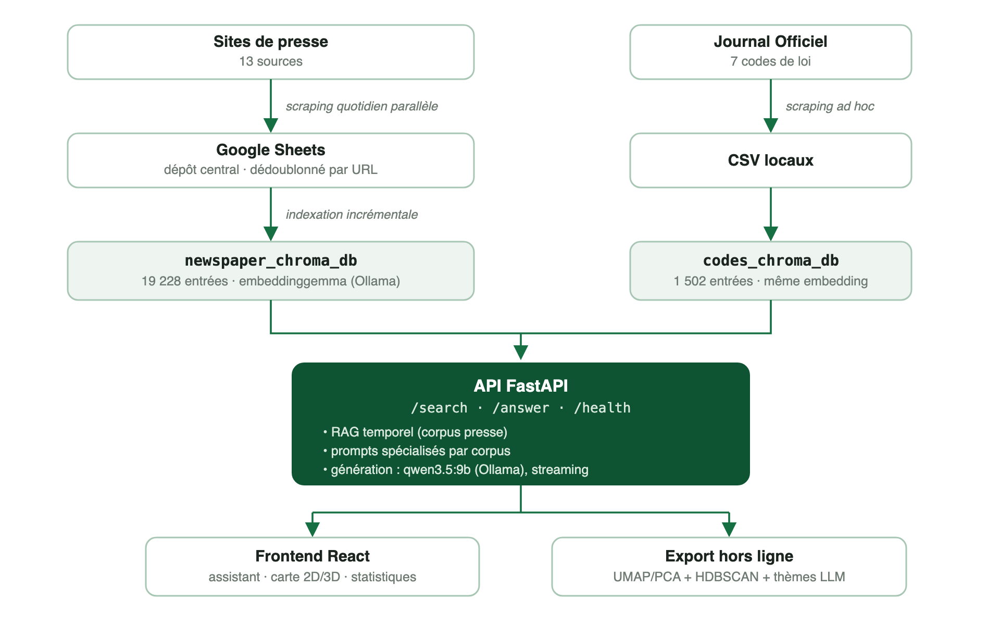

# Le Kiosque

## Une plateforme souveraine d'intelligence documentaire pour la presse gabonaise

**Livre blanc · Version 3.0 · Juillet 2026**
Auteur : Vhiny Mombo

---

## Résumé exécutif

Le Kiosque est une plateforme qui agrège quotidiennement la presse en ligne gabonaise et la rend interrogeable en langage naturel. Un lecteur peut demander « Quelles sont les nouvelles du jour ? » ou « Que se passe-t-il avec la SEEG ? » et obtenir en quelques secondes une synthèse rédigée, datée et systématiquement sourcée, générée à partir des articles eux-mêmes, jamais à partir des connaissances générales du modèle. Un second corpus, les codes de loi gabonais du Journal Officiel, est interrogeable dans la même interface avec citation systématique des numéros d'articles.

Trois choix structurent le projet :

1. **La génération augmentée par récupération (RAG)** : chaque réponse est construite exclusivement à partir de documents réels retrouvés dans le corpus. Cette contrainte élimine le principal défaut des assistants IA génériques, l'invention de faits, et garantit la traçabilité de chaque affirmation vers sa source.
2. **La conscience du temps** : l'actualité est une matière périssable. Le Kiosque implémente un *RAG temporel* complet : extraction de fenêtres de dates depuis la question, filtrage par plage au niveau de l'index, et classement par score composite pertinence × fraîcheur.
3. **La souveraineté technologique** : l'intégralité de la chaîne (collecte, indexation, recherche, génération) s'exécute localement, sur une seule machine, avec des modèles open source. Aucune donnée ne transite par un service d'IA tiers, et le coût marginal d'une question est nul.

Le corpus presse couvre treize titres gabonais en ligne, soit 18 517 articles au 20 juillet 2026, collectés en continu depuis décembre 2025 (le rattrapage historique remonte à septembre 2025 pour certaines sources). Le corpus juridique compte 1 502 articles de loi issus de cinq codes en vigueur.

---

## 1. Contexte et motivations : une presse riche, un accès fragmenté

La presse en ligne gabonaise est vivante et diverse, mais son exploitation reste laborieuse. L'information est éclatée entre des sites indépendants, sans moteur de recherche transversal, sans archives structurées communes, et sans moyen simple de reconstituer la chronologie d'un dossier (une crise de l'eau, une loi de finances, une élection professionnelle) à travers plusieurs rédactions.

Les assistants IA grand public ne comblent ce vide qu'en partie. Équipés d'outils de recherche web, ils savent désormais consulter des sources en ligne et citer des liens. Mais leur couverture de la presse gabonaise reste tributaire de l'indexation des grands moteurs de recherche, qui référencent mal les sites à faible audience internationale ; ils échantillonnent quelques pages au moment de la question, sans corpus exhaustif ni archive (un article dépublié ou un site momentanément hors ligne sort de leur champ) ; ils n'offrent ni analyse transversale du corpus (volumes, thématiques, chronologies), ni contrôle du périmètre des sources ; et chaque question transite par une infrastructure étrangère, avec un coût à l'usage. Les moteurs de recherche classiques, eux, renvoient des liens, pas des réponses.

Le Kiosque occupe l'espace entre les deux : un corpus national exhaustif, maîtrisé, archivé et enrichi quotidiennement, interrogeable en langage naturel, dont chaque réponse est ancrée dans des documents identifiés.

### 1.1 Les motivations du projet

Cinq motivations, explicites dès l'origine, structurent le projet :

1. **Rendre exploitable la diversité de la presse gabonaise.** Le paysage médiatique en ligne est d'une abondance remarquable : début 2024, la Haute Autorité de la Communication recensait [169 médias en ligne, dont 29 en situation régulière](https://gabonmediatime.com/gabon-liste-des-29-medias-en-ligne-en-situation-reguliere-sur-169-recenses/). Ce pluralisme est une richesse démocratique, mais il reste théorique pour le lecteur : personne ne consulte des dizaines de sites chaque jour, et chacun se replie en pratique sur deux ou trois titres, avec les angles morts que cela suppose. En agrégeant les rédactions établies dans un corpus unique interrogeable d'une seule question, Le Kiosque transforme cette diversité nominale en diversité effective : chaque réponse confronte les traitements de plusieurs rédactions, et les titres plus modestes apparaissent à égalité avec les plus visibles.

2. **Réduire l'asymétrie d'accès à l'information.** Suivre un dossier (une crise de l'eau, une loi de finances, une nomination) à travers treize rédactions sur plusieurs mois est aujourd'hui un travail de documentaliste, accessible aux seules organisations qui peuvent y consacrer une équipe de veille. La question en langage naturel, la synthèse sourcée et la chronologie automatique mettent ce travail à la portée d'un citoyen, d'un étudiant, d'un journaliste ou d'un chercheur, en quelques secondes et sans compétence technique.

3. **Une IA digne de confiance pour l'information.** Appliquée à l'actualité, l'invention de faits par les modèles de langage n'est pas un défaut tolérable : une affirmation non sourcée sur une nomination ou un chiffre de dette publique est pire qu'inutile. Le choix du RAG strict (répondre uniquement à partir des articles retrouvés, citer chaque source, dater chaque fait) est une position de principe : l'IA doit rendre l'information plus vérifiable, pas moins.

4. **Offrir un observatoire factuel du paysage médiatique.** Un secteur où 169 médias coexistent et où une minorité satisfait aux exigences réglementaires est un secteur qui se connaît mal lui-même : qui publie réellement, à quel rythme, sur quels sujets ? En mesurant en continu la production effective des rédactions (volumes quotidiens, rubriques, cadences comparées, thématiques émergentes), Le Kiosque produit une donnée objective qui manque à tous les acteurs : aux rédactions pour se situer, aux chercheurs et étudiants en sciences de l'information pour travailler sur pièces, aux annonceurs et institutions pour apprécier l'audience réelle du secteur, et au débat public pour parler du paysage médiatique à partir de mesures plutôt que d'impressions.

5. **Faire la preuve d'une faisabilité réplicable.** Le projet démontre qu'une plateforme d'intelligence documentaire nationale (collecte, archivage, recherche sémantique, synthèse par IA, cartographie thématique) peut être construite et opérée par une très petite équipe, avec du matériel ordinaire et des briques open source. La méthode est documentée dans ce livre blanc précisément pour être transposable : à d'autres pays, à d'autres corpus (presse régionale, littérature grise, archives institutionnelles), à d'autres langues.

L'extension aux codes de loi relève de la même logique appliquée au droit : les textes en vigueur existent en PDF au Journal Officiel, mais chercher « ce que dit la loi » article par article reste hors de portée du non-juriste. Le même socle technique les rend interrogeables, avec citation systématique des numéros d'articles.

---

## 2. La plateforme

**L'assistant conversationnel.** L'utilisateur pose ses questions en français et choisit son corpus (📰 Presse ou ⚖️ Codes de loi). Le système retrouve les documents pertinents, génère une synthèse en streaming, et affiche les sources directement sous chaque réponse (titre, journal ou code, date, lien vers l'original). La conversation est réellement conversationnelle : les questions de suivi (« et à Port-Gentil ? ») sont interprétées dans le contexte des échanges précédents, et l'historique survit au rechargement de la page.

**La carte sémantique.** Le corpus presse est projeté en deux ou trois dimensions : chaque point est un article, la proximité spatiale reflète la proximité de sens, une légende explique la lecture (« deux points proches traitent de sujets similaires »). Les grappes thématiques sont détectées automatiquement et nommées par le modèle de langage, ou remplacées par la rubrique éditoriale ou le journal au choix. La carte est réellement interactive, pas seulement décorative : cliquer un point ouvre l'article original ; cliquer une entrée de légende isole sa catégorie (le reste du nuage passe en gris neutre, sans disparaître, pour garder le contexte spatial) ; sur mobile, où un tap se confond souvent avec le geste de rotation 3D, le survol/tap sélectionne le point et une barre de confirmation dédiée ouvre l'article en un second tap sûr. Les articles retrouvés par une recherche s'illuminent sur la carte. La carte est masquable d'un clic pour les usages non techniques (repli automatique sur mobile), préférence mémorisée par navigateur et par taille d'écran.

**Le tableau de bord statistique.** Indicateurs clés du corpus (volumes, moyennes, records, activité du jour comparée à sa moyenne pour ce jour de semaine), répartition par journal, évolution de la publication sur fenêtre réglable (30 jours à tout l'historique, au pas journalier ou hebdomadaire), dynamique des sources (aujourd'hui comparé à la moyenne habituelle pour ce jour de semaine, 7 jours, ou volume total), répartition thématique, profil éditorial de chaque rédaction et fraîcheur de la collecte source par source.

**Les rapports éditoriaux.** Deux rapports générés à la demande depuis l'interface : le point d'actualité du jour (strictement les articles du jour, avec repli automatique sur la dernière journée couverte si la collecte n'a pas encore tourné) et la revue de presse hebdomadaire. Chacun est rédigé par le modèle local à partir des titres de la période, streamé dans un panneau dédié, puis exportable en PDF maquetté : couverture, nuage des mots des titres, graphiques commentés, références cliquables vers les articles originaux et note méthodologique.

**L'accessibilité et le multi-écran.** L'interface est pensée pour un lectorat majoritairement mobile : mise en page qui s'empile sur petit écran plutôt que de comprimer deux colonnes, carte et rapports en panneaux plein écran superposables plutôt qu'en colonnes concurrentes, cibles tactiles dimensionnées pour le doigt. Côté lecteurs d'écran et navigation clavier : régions ARIA nommées (`role="log"` pour le fil de conversation, `role="region"` pour la carte), focus visible sur tous les éléments interactifs, `Échap` referme les panneaux ouverts avec retour du focus au bouton d'origine, et les panneaux réduits sont retirés de l'ordre de tabulation (`inert`) plutôt que de laisser des contrôles invisibles mais atteignables au clavier. La génération de réponse est annoncée en direct (`aria-live`) sans lire chaque mot du flux : la phase de recherche est annoncée à chaque étape, puis la réponse complète est lue d'un bloc à la fin du streaming plutôt que mot à mot, ce qui serait inexploitable. Le contraste texte/fond est vérifié au ratio WCAG AA sur l'ensemble de la palette.

---

## 3. Architecture technique

### 3.1 Vue d'ensemble



Pile logicielle : Python 3.13, FastAPI + Uvicorn, ChromaDB (persistance locale), LangChain (liaison Ollama), React 19 + Vite, Plotly. Tous les paramètres sensibles (modèles, seuils, poids, port) sont pilotables par variables d'environnement.

### 3.2 Collecte

Treize scrapers spécialisés s'exécutent en parallèle chaque jour. Deux familles :

- **Sites WordPress à API REST ouverte** (Dépêches 241, 7 Jours Info, Éthique Média, Focus Groupe Média, Gabon All Sport, Gabon Quotidien, Direct Infos Gabon, Inside News 241, Kongossa News) : interrogation directe de `/wp/v2/posts` avec filtre `after=<date>` côté serveur, 50 articles par requête, résolution des catégories via `/wp/v2/categories`. Un module partagé (`wp_rest_scraper.py`) factorise cette logique : ajouter une source WordPress coûte une quinzaine de lignes. Un rattrapage historique de 7 mois représente environ 30 requêtes ; il a été appliqué aux neuf sources de cette famille.
- **Sites à parcours HTML** (GabonReview, GabonMediaTime, GabonActu, L'Union) : pagination des pages de rubriques, extraction de la date via la balise `article:published_time`, arrêt après deux pages consécutives sans article dans la fenêtre cible.

Les articles normalisés (rubrique, titre, date ISO, URL, texte intégral) sont versés dans un dépôt central Google Sheets, un onglet par source, qui sert de couche d'audit humaine : le corpus brut est lisible et corrigeable. Le dédoublonnage par URL est appliqué à chaque étage (scraper, Sheets, indexation), ce qui rend toute la chaîne ré-exécutable sans effet de bord. Limite technique gérée : Google Sheets plafonne à 50 000 caractères par cellule ; les textes sont tronqués à 48 000 avec marqueur.

### 3.3 Indexation vectorielle

- **Modèle d'embedding** : `embeddinggemma` (open source, exécuté par Ollama), choisi pour son rapport qualité/coût en français. Il tronque au-delà d'environ 2 048 tokens, ce qui impose le découpage ci-dessous.
- **Chunking** : les articles de plus de 6 000 caractères sont découpés en chunks de 4 500 caractères avec recouvrement de 400, en privilégiant les frontières de paragraphes puis de phrases. Le chunk 0 conserve l'identifiant de base de l'article (hash MD5 de l'URL) ; les suivants reçoivent `<id>#N` et un en-tête synthétique portant le titre, pour rester interprétables isolément.
- **Métadonnées** : source, rubrique, titre, date ISO, et un horodatage numérique `published_ts` (epoch Unix). Cette double représentation existe parce que ChromaDB ne supporte les opérateurs de plage (`$gte`/`$lte`) que sur les nombres. Une migration a rétro-rempli le champ sur les 9 758 entrées antérieures, par mise à jour de métadonnées seule, sans re-vectorisation.
- **Indexation incrémentale** : seuls les articles absents de l'index sont vectorisés, par lots de 64 avec trois tentatives et backoff (l'API d'embedding locale peut échouer sur de gros lots). Une mise à jour quotidienne typique (30 à 50 articles) prend moins d'une minute.

### 3.4 RAG temporel

La similarité sémantique seule répond mal aux questions d'actualité : un article de fond vieux de six mois peut être plus « proche » de la question que la dépêche d'hier qui y répond réellement (*knowledge drift*). Le Kiosque traite le temps en trois étages :

**a) Extraction de fenêtre.** Un analyseur à règles (zéro appel LLM, latence nulle) classe l'intention temporelle :

| Déclencheur | Fenêtre |
|---|---|
| « aujourd'hui », « du jour », « en ce moment » | 48 h, ancrées sur le dernier article collecté |
| « hier » | depuis la veille minuit |
| « cette semaine », « récent », « actualité »… | 7 jours |
| « ce mois », « ces dernières semaines » | 30 jours |
| mois explicite (« en mars 2026 ») | le mois calendaire |
| intention prospective (« futur », « prochain », « prévu ») | 14 jours (les annonces vivent dans le récent) |

L'ancrage sur le dernier article collecté rend « les nouvelles du jour » robuste aux décalages de collecte : si le scraping n'a pas encore tourné, la fenêtre glisse sur la dernière journée couverte. Une version antérieure classifiait l'intention par appel au LLM ; elle ajoutait plusieurs secondes par recherche et a été remplacée par ces règles.

**b) Récupération fenêtrée.** La recherche vectorielle est contrainte par un filtre d'index `published_ts ∈ [début, fin]`, en récupérant jusqu'à 100 candidats dans la fenêtre (contre 30 hors mode temporel). L'implémentation initiale ratissait 2 000 candidats sur tout le corpus puis triait par date en Python ; le filtrage à l'index l'a remplacée.

**c) Classement par décote.** Les candidats sont ordonnés par :

```
score = 0,6 × similarité + 0,4 × fraîcheur
similarité = max(0 ; 1 − distance/2)
fraîcheur  = 0,5^(âge_en_jours / 2)        (demi-vie : 2 jours)
```

Un article très pertinent d'avant-hier peut ainsi devancer un article vaguement pertinent d'aujourd'hui, ce qu'un tri par date interdit. Poids et demi-vie sont réglables par variables d'environnement (`SIMILARITY_WEIGHT`, `RECENCY_WEIGHT`, `RECENCY_HALF_LIFE_DAYS`).

Les questions sans dimension temporelle suivent le chemin classique : recherche sémantique avec seuil de distance (1,7 pour la presse, 1,9 pour les codes, dont la formulation s'éloigne davantage de celle des requêtes).

**d) Fraîcheur légère pour les questions non temporelles.** La dérive de connaissance touche aussi les questions sans marqueur temporel. « La dette de l'État » n'est pas une requête temporelle, mais sa bonne réponse change chaque mois ; en similarité pure, un dossier soigné vieux de six mois devance la dépêche d'hier qui porte le chiffre à jour. Les candidats presse qui passent le seuil de pertinence sont donc réordonnés avec la même formule de décote, mais en gardant la similarité dominante et une décroissance lente :

```
score = 0,85 × similarité + 0,15 × fraîcheur      (demi-vie : 45 jours)
```

Mesure sur 12 questions à sujet évolutif formulées sans mot-clé temporel (« dette de l'État », « prix du carburant », « salaire des fonctionnaires »…), en reproduisant le pipeline de recherche complet sur le corpus réel (18 299 articles, 17 juillet 2026) :

| Métrique (top 5) | Similarité pure | Avec décote de fraîcheur |
|---|---|---|
| Âge médian du premier résultat | 141 jours | 19 jours |
| Âge médian des articles récupérés | 155 jours | 23 jours |
| Requêtes où l'article pertinent le plus récent atteint le top 5 | 3/12 | 12/12 |
| Distance sémantique moyenne (coût en pertinence) | 1,082 | 1,120 (+3,5 %) |

La couverture pertinente la plus fraîche atteint désormais le modèle sur chacune des questions testées, pour un coût en pertinence quasi nul ; un article ancien réellement pertinent continue de devancer un article frais à peine pertinent, la similarité pesant 85 % du score.

Les valeurs par défaut ne sortent pas d'une intuition : le même script balaie la grille (poids, demi-vie) sur le même jeu de questions, en réordonnant un unique pool de candidats par question, de sorte que le balayage complet ne coûte qu'un appel d'embedding par question. Points représentatifs :

| Poids fraîcheur | Demi-vie | Âge médian du 1er résultat | Plus récent dans le top 5 | Distance moyenne |
|---|---|---|---|---|
| 0 (comportement antérieur) | – | 141 j | 3/12 | 1,082 |
| 0,05 | 45 j | 87 j | 5/12 | 1,086 |
| 0,10 | 45 j | 27 j | 9/12 | 1,101 |
| **0,15** | **45 j** | **19 j** | **12/12** | **1,120** |
| 0,15 | 7 j | 72 j | 9/12 | 1,101 |
| 0,25 | 45 j | 19 j | 12/12 | 1,147 |
| 0,40 | 45 j | 12 j | 12/12 | 1,160 |

0,15 / 45 jours est la configuration la moins coûteuse qui fait remonter l'article pertinent le plus récent sur chaque question. Des poids plus lourds achètent quelques jours de fraîcheur pour un coût en pertinence double à triple, et une demi-vie courte va à l'encontre du but recherché : à 7 jours, tout ce qui a plus de quelques semaines tombe à une fraîcheur quasi nulle, et le classement ne distingue plus un article de deux mois d'un article de six mois (le plus récent plafonne à 9/12 même à un poids de 0,40). Les trois paramètres restent réglables par variables d'environnement (`NONTEMPORAL_SIM_WEIGHT`, `NONTEMPORAL_REC_WEIGHT`, `NONTEMPORAL_HALF_LIFE_DAYS`), et le prompt de génération exige en outre que, lorsque les articles donnent des chiffres différents pour un même sujet à des dates différentes, le plus récent ouvre la réponse et les plus anciens soient présentés comme un historique. Banc d'essai et balayage sont reproductibles via `scripts/benchmark_recency.py`.

### 3.5 Recherche et génération

**Deux endpoints découplés.** `/search` retourne les documents classés (titre, date, source, extrait, distance) ; `/answer` reçoit la question et les identifiants des documents retenus, recharge leur **texte intégral** côté serveur (jamais fourni par le client, qui ne pourrait envoyer que des extraits tronqués et serait manipulable), réassemble les chunks dans l'ordre en retirant les en-têtes synthétiques, et streame la synthèse. Chaque article est plafonné à 4 000 caractères de contexte ; la fenêtre du modèle est configurée à 16 384 tokens.

**Suivis conversationnels, aux deux étages.** À la récupération, une heuristique détecte les questions dépendantes du contexte (moins de cinq mots, connecteurs « et… », « mais… », pronoms, anaphores « cette affaire ») et vectorise alors la concaténation question précédente + question courante. À la génération, les trois derniers échanges sont rejoués comme tours de dialogue (réponses tronquées à 1 200 caractères). L'heuristique est volontairement conservatrice : un faux positif tirerait une question sans rapport dans l'embedding.

**Ingénierie de prompt pour petits modèles.** Trois enseignements empiriques, chacun issu d'un échec observé :

1. *Les injonctions contradictoires fabriquent des réponses.* Le prompt initial ordonnait « ne dis jamais que tu n'as pas d'information ». Face à une question sans réponse dans le corpus (« quel est le prochain déplacement du président ? »), le modèle détournait des articles voisins (horaires de trains) pour donner l'impression de répondre. La règle actuelle : réponse directe quand les articles répondent ; sinon le dire en une phrase, puis résumer ce qui s'en approche.
2. *La position de la question compte.* Les petits modèles pondèrent davantage la fin du prompt : la question apparaît en tête (avant les règles) et en rappel final (« Réponds uniquement à cette question, sur son sujet exact »).
3. *Les formules imposées contaminent.* Imposer un préfixe exact pour le cas « pas de réponse » a conduit le modèle à l'utiliser systématiquement, même quand les articles répondaient. La formulation conditionnelle explicite (« dans le cas normal… / dans le cas contraire… ») a corrigé le biais.

**Corpus juridique.** Prompt système distinct : citation obligatoire du numéro d'article pour chaque affirmation, interdiction de reformulation approximative des dispositions, aveu explicite lorsque les extraits ne couvrent pas la question, et mention finale de non-conseil juridique. Le contexte est rechargé par identifiant d'entrée (et non par URL : tous les articles d'un même code partagent la page du Journal Officiel).

### 3.6 Choix des modèles : mesures

Le modèle de génération est substituable par variable d'environnement. Mesures réalisées sur la machine de développement (Apple Silicon, inférence GPU Metal via Ollama), réponse complète sur les questions de test du projet :

| Modèle | Mode | Latence/réponse | Qualité observée |
|---|---|---|---|
| phi4-mini (3,8 B) | standard | ~13 s | Correcte ; fragile sur les nuances (sujet, intention) |
| qwen3.5:9b | thinking actif | 116 à 614 s | Excellente mais inutilisable en interactif |
| **qwen3.5:9b** | **thinking désactivé** | **10 à 14 s** | **Excellente : sujet exact, dates justes, honnêteté** |
| qwen3:4b | thinking actif | 65 à 83 s | Très bonne ; option « raisonnement » économique |
| qwen3:4b | thinking désactivé | non exploitable | Le template Ollama laisse fuir le raisonnement |

Enseignement principal : les modèles à raisonnement (famille Qwen3) génèrent par défaut des milliers de tokens de réflexion invisibles, multipliant la latence par 10 à 40 pour un gain marginal en synthèse documentaire. L'API les détecte par préfixe de nom et désactive le raisonnement (`reasoning=False`), réactivable par `OLLAMA_REASONING=true` pour les usages analytiques. Configuration par défaut retenue : **qwen3.5:9b sans thinking**, dont la qualité s'approche des modèles hébergés pour ce cas d'usage, à latence interactive (streaming : premier token en 2 à 5 s).

### 3.7 Exploration visuelle

Un traitement hors ligne extrait les vecteurs de l'index, calcule quatre projections (PCA et UMAP, en 2D et 3D ; UMAP avec `n_neighbors=15`, `min_dist=0.1`), détecte les grappes par HDBSCAN dans l'espace UMAP 3D (taille minimale adaptative selon le corpus), puis fait nommer chaque grappe par le LLM à partir d'un échantillon de titres. Le tout est exporté en JSON statique consommé par le frontend (Plotly).

**De la carte décorative à la carte exploratoire.** Trois interactions distinguent une visualisation qu'on regarde d'une visualisation qu'on utilise : le clic ouvre l'article (`plotly_click`) ; le survol sélectionne un point pour le confirmer ensuite via un bouton dédié sur mobile (`plotly_hover`, car un tap y démarre souvent le geste de rotation 3D avant d'être reconnu comme un clic) ; et cliquer une entrée de légende isole sa catégorie sur la carte elle-même. Cette dernière interaction a révélé une leçon d'ingénierie non triviale. Premier essai : baisser l'opacité des catégories non sélectionnées via `Plotly.react()` — sans effet visible dans les zones denses, où des centaines de points semi-transparents superposés se recomposent optiquement vers une couleur quasi pleine (`1 − (1 − opacité)ⁿ → 1` quand n croît). Deuxième essai : masquer entièrement les autres traces (`visible: false`) via `Plotly.restyle()` — techniquement efficace mais mal conçu du point de vue produit, puisqu'il fait disparaître le contexte spatial du reste du corpus au lieu de simplement le mettre en retrait. Solution retenue : recolorer les catégories non sélectionnées en gris neutre plutôt que d'en réduire l'opacité — du gris superposé à du gris reste du gris, aucune recomposition optique possible, et le nuage reste peuplé. Un piège plus subtil est apparu à cette étape : `Plotly.react()` conserve les mêmes références d'objets que celles passées en entrée, si bien que chaque appel à `Plotly.restyle()` mute en place les objets React eux-mêmes ; en relisant une couleur « de base » depuis ces objets déjà mutés, un cycle sélection/désélection répété faisait perdre de façon permanente la couleur d'origine d'une catégorie. Correctif : ne jamais relire l'état visuel courant du graphique comme source de vérité, toujours recalculer la couleur et l'opacité de référence depuis les données React elles-mêmes.

### 3.8 Rapports éditoriaux automatisés

Les endpoints `/daily_report` et `/weekly_report` rédigent une synthèse à partir des seuls titres de la période, encadrée par des chiffres clés calculés du corpus (volumes, sources actives, jour le plus actif, rubriques dominantes). La fenêtre quotidienne est stricte : uniquement les articles du jour, avec repli sur la dernière journée couverte quand le jour est encore vide, et le prompt reçoit la période exacte couverte afin de dater les faits plutôt que de les présenter comme courants. Le texte est streamé vers l'interface puis mis en cache tant que la fenêtre et le volume d'articles n'évoluent pas.

La version PDF réutilise la même synthèse et l'habille : couverture maquettée, nuage des mots des titres (fréquences accent-insensibles avec conservation de la graphie majoritaire, noms composés préservés, mots outils et mentions génériques exclus), graphiques lets-plot de style BBC encadrés d'un paragraphe d'introduction et d'une « Lecture » guidée, sélection de références choisies par recouvrement lexical entre titres et synthèse (dédoublonnée des reprises multi-sources), chacune liée à l'article original, et note méthodologique de clôture.

### 3.9 Rattrapage de classification par LLM

Le premier chantier de qualité des données identifié en section 6 des versions précédentes de ce document a été traité. Environ un quart des articles portaient une rubrique générique héritée du scraping (« À la une », « Actualités ») ou aucune rubrique du tout, à des taux très inégaux selon la source : 100 % pour Direct Infos Gabon et Gabon All Sport, 99 % pour 7 Jours Info, contre une poignée de pour cent pour les sources historiquement les mieux structurées. Le script `scripts/backfill_categories.py` traite ces entrées en deux passes : les sources mono-thématiques (Gabon All Sport, exclusivement sportif) sont reclassées par règle directe sans appel au modèle ; le reste est classé par lots de vingt titres soumis au LLM local, contraint à répondre dans la taxonomie éditoriale du projet (Politique, Économie, Société, Sport, Faits Divers / Justice, Culture, Provinces, Environnement, Santé, Éducation, Administration, Diplomatie, International, IA / Numérique, Communication, Autres). Chaque entrée conserve sa rubrique d'origine dans un champ `category_original` et un marqueur `category_source` (`llm` ou `source-rule`), rendant la passe auditable et réversible ; le script est également reprenable, les entrées déjà traitées étant ignorées en cas d'interruption.

Résultat mesuré sur le corpus complet (18 480 articles au moment du traitement) : la part de rubriques génériques ou absentes passe de 24,0 % à 0,7 %, soit 4 429 articles reclassés (3 687 par le LLM, 621 par la règle de source, 121 restant sans réponse exploitable du modèle). La rubrique dominante parmi les articles reclassés est Économie, ce qui confirme que le défaut touchait principalement du contenu économique et institutionnel généraliste plutôt que du contenu réellement hors sujet.

---

## 4. Souveraineté et IA locale

Le choix d'une exécution intégralement locale n'est pas un détail d'implémentation, c'est une thèse :

- **Confidentialité** : les questions des utilisateurs, qui révèlent des centres d'intérêt politiques, économiques ou judiciaires, ne quittent jamais la machine.
- **Indépendance** : aucune API d'IA tierce, aucun quota, aucune exposition aux évolutions tarifaires ou contractuelles d'un fournisseur. Une fois la collecte effectuée, le système fonctionne hors ligne.
- **Coût** : coût marginal nul par question. L'ensemble tourne sur une machine de bureau ; l'inférence GPU (Metal) y est native, sans matériel dédié.
- **Reproductibilité** : modèles, base vectorielle et pile applicative intégralement open source. Le dispositif est réplicable pour n'importe quel corpus de presse national.

Le Kiosque démontre qu'une infrastructure d'intelligence documentaire de presse peut être construite et opérée localement, à coût quasi nul, pour un écosystème médiatique qui n'est prioritaire pour aucun grand acteur technologique.

---

## 5. État des corpus

**Presse** (18 517 articles uniques, 19 228 entrées indexées au 20 juillet 2026) :

| Source | Couverture | Articles |
|---|---|---|
| GabonMediaTime | déc. 2025 → aujourd'hui | 3 612 |
| GabonReview | déc. 2025 → aujourd'hui | 2 970 |
| L'Union | déc. 2025 → aujourd'hui | 2 664 |
| Focus Groupe Média | déc. 2025 → aujourd'hui (rattrapé) | 1 728 |
| GabonActu | déc. 2025 → aujourd'hui | 1 706 |
| Direct Infos Gabon | déc. 2025 → aujourd'hui (rattrapé) | 1 327 |
| 7 Jours Info | déc. 2025 → aujourd'hui (rattrapé) | 1 122 |
| Inside News 241 | déc. 2025 → aujourd'hui (rattrapé) | 761 |
| Dépêches 241 | sept. 2025 → aujourd'hui (rattrapé) | 748 |
| Gabon All Sport | déc. 2025 → aujourd'hui (rattrapé) | 621 |
| Kongossa News | déc. 2025 → aujourd'hui (rattrapé) | 510 |
| Gabon Quotidien | déc. 2025 → aujourd'hui (rattrapé) | 434 |
| Éthique Média Gabon | déc. 2025 → aujourd'hui (rattrapé) | 314 |

**Codes juridiques** (1 502 articles de loi, granularité : l'article) : Code pénal, Code minier, Code des hydrocarbures, Code de l'enfant, Code de la nationalité. Référencés mais restant à intégrer : Code du travail, Code pénal modifié.

Le pipeline complet (13 scrapers parallèles → Sheets → indexation incrémentale → export des projections) s'exécute quotidiennement en une commande et notifie son avancement ; il est planifié trois fois par jour (10 h, 15 h, 20 h) via cron.

---

## 6. Limites connues

- **Évaluation partielle.** La fraîcheur de la récupération est désormais mesurée par un banc reproductible (§ 3.4 d), mais la fidélité des synthèses au contenu des articles reste validée empiriquement ; un banc d'évaluation complet (questions datées annotées, métriques de fidélité) reste à construire.
- **Recherche purement vectorielle.** Les noms propres rares et sigles exacts bénéficieraient d'une recherche hybride (BM25 + vecteurs).
- **Heuristique de suivi conservatrice.** Un suivi formulé comme une question autonome peut échapper à l'enrichissement contextuel à la récupération ; le modèle de génération, qui voit l'historique, compense en général.
- **Partage public encore artisanal.** Une limitation de débit par client protège désormais les points de terminaison coûteux (`/answer`, `/search`, les rapports), et un tunnel Cloudflare permet un partage public temporaire du build de production ; mais l'URL n'est pas stable (elle change à chaque relance du tunnel), aucun contrôle d'accès n'existe au-delà du débit, et la capacité reste celle d'une seule machine : Ollama sérialise les générations, donc plusieurs utilisateurs simultanés font la queue plutôt que de répondre en parallèle. Un tunnel nommé avec Cloudflare Access (authentification par e-mail, jusqu'à 50 utilisateurs gratuitement) est le prochain palier pour un partage soutenu.
- **Corpus juridique partiel.** Cinq codes sur sept référencés sont intégrés (§ 5) ; le Code du travail et le Code pénal modifié restent à indexer.

---

## 7. Feuille de route

- **Recherche hybride** BM25 + vecteurs pour les entités nommées.
- **Corpus** : intégration du Code du travail et du Code pénal modifié, exploration systématique du Journal Officiel (le rattrapage historique des sources WordPress est fait, la classification de rattrapage par LLM est faite — § 3.9).
- **Croisement presse ↔ droit** : « que dit la loi sur ce dont parle cet article ? », la fonctionnalité différenciante que la double indexation rend possible.
- **Évaluation** : jeu de test de questions datées, mesure de la précision temporelle et de la fidélité des synthèses.
- **Déploiement soutenu** : tunnel Cloudflare nommé avec URL stable et Cloudflare Access pour le contrôle d'accès, au-delà du tunnel temporaire et de la limitation de débit déjà en place (§ 6).
- **Signal de qualité** : mécanisme de retour utilisateur (pouce haut/bas) sur les réponses générées, pour disposer d'une mesure de satisfaction en production au-delà des tests manuels.

---

## 8. Conclusion

Le Kiosque démontre qu'avec des composants entièrement open source et une machine ordinaire, un écosystème de presse national peut être doté d'une infrastructure moderne d'accès à l'information : recherche sémantique, synthèses sourcées, conscience du temps, corpus juridique, exploration visuelle. La méthode (corpus vivant, RAG temporel, exécution souveraine) est transposable à d'autres pays, d'autres corpus, d'autres échelles.

L'information de qualité existe ; la presse gabonaise la produit chaque jour. Le Kiosque travaille à ce qu'elle soit trouvable, vérifiable et mémorisée.

---

*Document produit dans le cadre du projet Le Kiosque. Contact : Vhiny Mombo.*
